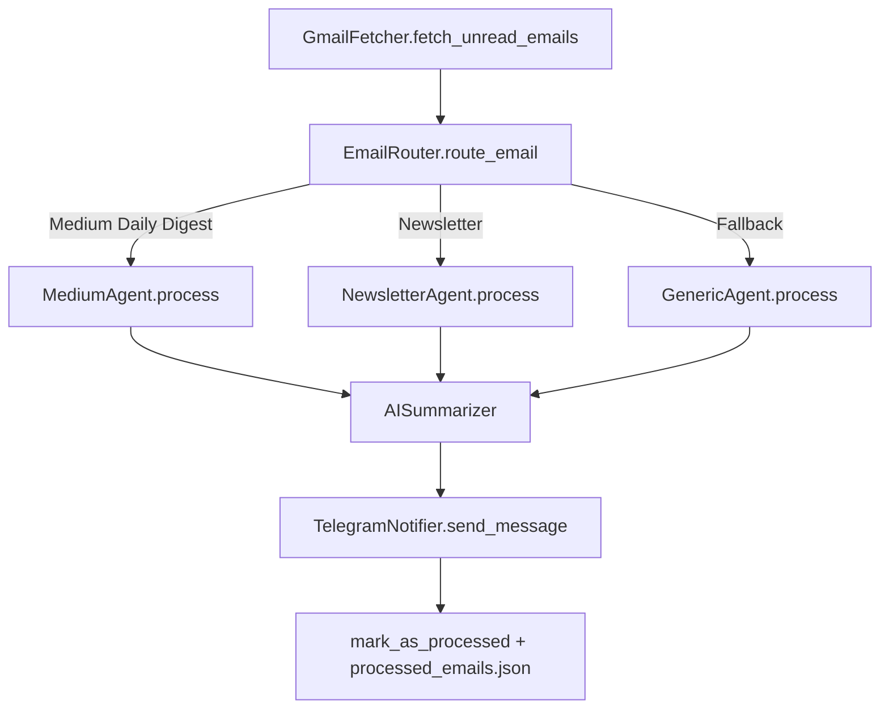

# MediumDailyDigest — Modular AI Email Agent

MediumDailyDigest is a production-oriented AI email agent pipeline that reads newsletter emails from Gmail, routes each email to the proper processing agent, summarizes only the high-value excerpts with LLMs, and sends intelligence digests to Telegram.

## Why this architecture

This project is refactored from a script-style flow to a clean modular architecture inspired by agent/service layering:

- **Agents** handle source-specific parsing logic.
- **Services** handle Gmail, AI, and notification integrations.
- **Router** decides which agent should process each email.
- **Storage** prevents duplicate processing.
- **Config** centralizes environment and runtime behavior.

## Project Structure

```text
MediumDailyDigest/
├── agents/
│   ├── generic_agent.py
│   ├── medium_agent.py
│   └── newsletter_agent.py
├── config/
│   └── settings.py
├── core/
│   └── router.py
├── services/
│   ├── ai/
│   │   └── summarizer.py
│   ├── gmail/
│   │   ├── client.py
│   │   ├── fetcher.py
│   │   └── filters.py
│   └── notifier/
│       └── telegram.py
├── storage/
│   └── processed_emails.json
├── run.py
└── requirements.txt
```

## Architecture Diagram



## Main Pipeline (`run.py`)

1. Fetch unread emails (optionally filtered)
2. Route each email to the correct agent
3. Extract compact article signals (title, link, preview)
4. Summarize via Gemini (OpenAI fallback)
5. Send digest to Telegram in Markdown
6. Mark email processed + persist local processed IDs

## Cost Optimization Strategy

To reduce LLM token usage:

- Never send full HTML to LLM.
- Parse and send only: `title`, `link`, and truncated `excerpt`.
- Enforce excerpt caps (default: first 1000 chars).
- Limit article count per email (`MAX_ARTICLES_PER_EMAIL`).
- Prefer Gemini Flash for low-cost high-speed inference.

## Setup Instructions

### 1) Install

```bash
python -m venv .venv
source .venv/bin/activate
pip install -r requirements.txt
```

### 2) Required Environment Variables

| Variable | Required | Description |
|---|---|---|
| `GMAIL_CREDENTIALS` | ✅ | OAuth client JSON string |
| `GMAIL_TOKEN` | Optional | Refreshable token JSON string |
| `GEMINI_API_KEY` | Recommended | Primary LLM provider |
| `OPENAI_API_KEY` | Optional | Fallback LLM provider |
| `TELEGRAM_TOKEN` | ✅ | Telegram bot token |
| `TELEGRAM_CHAT_ID` | ✅ | Target chat/channel id |

Optional runtime tuning:

- `MAX_ARTICLES_PER_EMAIL` (default: `5`)
- `MAX_PREVIEW_CHARS` (default: `1000`)
- `PROCESSED_STORE_PATH` (default: `storage/processed_emails.json`)

### 3) Run locally

```bash
python run.py
```

## Gmail Service API

`services/gmail/fetcher.py` exposes reusable operations:

- `fetch_unread_emails(label: str | None = None)`
- `fetch_by_label(label: str)`
- `mark_as_processed(message_id: str)`

Example:

```python
emails = gmail.fetch_unread_emails(label="medium")
```

## GitHub Actions

Workflow: `.github/workflows/daily.yml`

- Cron schedule: `0 7 * * *`
- Uses repository secrets:
  - `GEMINI_API_KEY`
  - `OPENAI_API_KEY`
  - `GMAIL_CREDENTIALS`
  - `GMAIL_TOKEN`
  - `TELEGRAM_TOKEN`
  - `TELEGRAM_CHAT_ID`

## Extending for New Newsletter Types

1. Add new agent in `agents/` implementing `BaseAgent.process(email)`.
2. Register rule in `EmailRouter` via `add_rule(...)` or constructor rule list.
3. Keep output as structured `AgentResult` with `ArticleCandidate` entries.
4. Summarizer will work unchanged.
